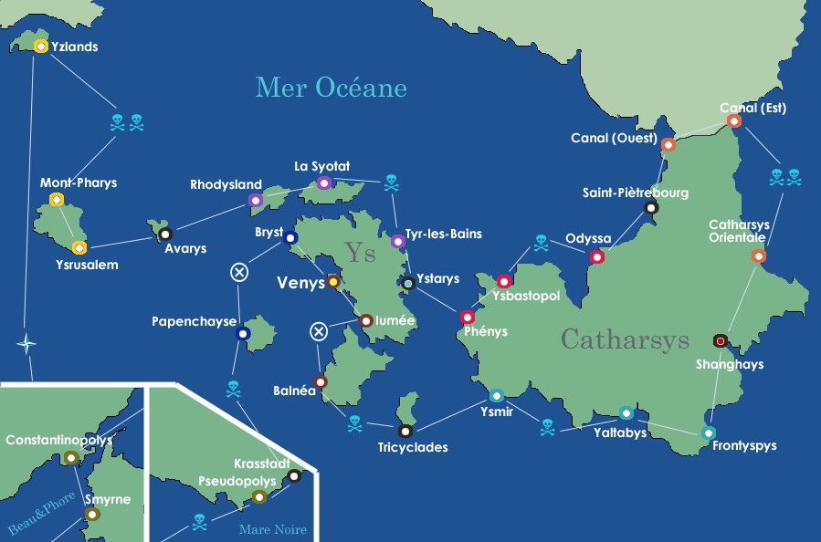

### La carte

### Petit lexyque des comptoirs et escales :

**Venys.** Port princypal de l'Empire. A chaque passage, la vente de votre marchandyse vous rapporte 20000 Y$. Si vous y restez un tour, 40000 y$. 

**Iumée.** Fenêtre maritime des culs-terreux d'Iumée. Produits agricoles.

**Balnéa.** Statyon balnéaire apprécyée l'été, port modeste.

**Tricyclades.** Port libre.

**Ysmir.** Fourrures et tyssus.

**Yaltabys.** Statyon balnéaire immortalysée par son traité. Petit port (sel, épyces) 

**Frontyspys.** Marbres et pyrite. 

**Shanghays.** Ville libre, repaire des Tryades chinyssoises. Bagne impérial. 

**Catharys Orientale.** Débouché commercyal des chercheurs d'or catharsyssois. Très animé la nuit. 

**Canal (est).** Comptoir assurant le contrôle de l'entrée du canal.

**Canal (ouest).** Encore plus prestigieux, le comptoir jumeau sytué côté Zollernberg.

**Saint-Piètrebourg.** Port libre, marché aux domestiques de l'Empire, où affluent tous les Crassyeux désyreux de gagner Venys. Ville construite par le Russlave Piotr la Perche, puys conquyse par Ys au XVIIème syècle.

**Odyssa.** La porte grinçante du grenier à blé de l'Archipel.

**Ysbastopol.** Chantier naval de première importance. Arrivages fréquents de Lolonayses.

**Phénys.** Plus grand et plus ancyen port de Catharsys.

**Ystarys.** Syège des banques et assurances maritimes yssoises. Si vous y restez un tour, vous empochez la somme de la banque.

**Tyr-les-Bains.** Gentiane et plantes médycinales. Centre de cure.  

**La Syotat.** Comptoir autrefoys impérial, aujourd'hui vendu à la découpe. Savons et huile d'olive.

**Rhodysland.** Île à l'opulence récente, due à l'oeuvre de Nikolaos d'Ophiccius.  

**Avarys.** Port libre, sur la route des Yzlands.

**Ysrusalem.** Ville symbole de l'affrontement entre Paxatagore et Mitylène, aujourd'huy pacyfiée.

**Mont-Pharys.** Mont-Pharys fournit en opium les cabarets et fumoirs de Venys.

**Yzlands.** A la porte du Zozoland, un comptoir cosmopolite et très dysputé.

**Marine Impériale.** Fraude fyscale, marins boukystanays non déclarés... Votre compte est bon ! Directyon Shanghays sans escale. 

**Smyrne.** Comptoir yssois en Crapadocce. Soie, bijoux, argent... 

**Constantinopolys.** La Sublimyssime Porte de l'Empire, accès privilégié à l'Eurobe Ventrale.

**Pseudopolys.** La Septentryssime Porte de l'Empire, accès privilégié à l'Eurobe Orysentale.

**Krasstadt.** Port libre adminystré et loué par le Konglomérat Hanserratike du même nom.

**Papenchayse.** Orfèvrerie et produits de luxe.

**Bryst.** A la pointe de la princypale île yssoise, la dernière escale avant Venys est aussy la plus chère.

### Montants des loyers

| Comptoir               | Coût  | Hypothèque | Passage | 1 atelier | 2 ateliers | 3 ateliers | 4 ateliers | Manufacture |
|------------------------|-------|------------|---------|-----------|------------|------------|------------|-------------|
| Iumée                  | 6000  | 3000       | 200     | 1000      | 3000       | 9000       | 16000      | 25000       |
| Balnéa                 | 6000  | 3000       | 400     | 2000      | 6000       | 18000      | 32000      | 45000       |
| Tricyclades            | 20000 | 10000      |         |           |            |            |            |             |
| Ysmir                  | 10000 | 5000       | 600     | 3000      | 9000       | 27000      | 40000      | 55000       |
| Yaltabys               | 10000 | 5000       | 600     | 3000      | 9000       | 27000      | 40000      | 55000       |
| Frontyspys             | 12000 | 6000       | 800     | 4000      | 10000      | 30000      | 45000      | 60000       |
| Catharsys Orientale    | 14000 | 7000       | 1000    | 5000      | 15000      | 45000      | 62500      | 75000       |
| Charybde(mercenaires)  | 15000 | 7500       |         |           |            |            |            |             |
| Canal (Est)            | 14000 | 7000       | 1000    | 5000      | 15000      | 45000      | 62500      | 75000       |
| Canal (Ouest)          | 16000 | 8000       | 1200    | 6000      | 18000      | 50000      | 70000      | 90000       |
| Saint-Piètrebourg      | 20000 | 10000      |         |           |            |            |            |             |
| Odyssa                 | 18000 | 9000       | 1400    | 7000      | 20000      | 55000      | 75000      | 95000       |
| Ysbastopol             | 18000 | 9000       | 1400    | 7000      | 20000      | 55000      | 75000      | 95000       |
| Phénys                 | 20000 | 10000      | 1600    | 8000      | 22000      | 60000      | 80000      | 100000      |
| Tyr-les-Bains          | 22000 | 11000      | 1800    | 9000      | 25000      | 70000      | 87500      | 105000      |
| La Syotat              | 22000 | 11000      | 1800    | 9000      | 25000      | 70000      | 87500      | 105000      |
| Rhodysland             | 24000 | 12000      | 2000    | 10000     | 30000      | 75000      | 92500      | 110000      |
| Avarys                 | 20000 | 10000      |         |           |            |            |            |             |
| Ysrusalem              | 26000 | 13000      | 2200    | 11000     | 33000      | 80000      | 97500      | 115000      |
| Mont-Pharys            | 26000 | 13000      | 2200    | 11000     | 33000      | 80000      | 97500      | 115000      |
| Zcygulla (Mercenaires) | 15000 | 7500       |         |           |            |            |            |             |
| Yzlands                | 28000 | 14000      | 2200    | 12000     | 36000      | 85000      | 102500     | 120000      |
| Smyrne                 | 30000 | 15000      | 2600    | 13000     | 39000      | 90000      | 110000     | 127500      |
| Constantinopolys       | 30000 | 15000      | 2600    | 13000     | 39000      | 90000      | 110000     | 127500      |
| Pseudopolys            | 32000 | 16000      | 2800    | 15000     | 45000      | 100000     | 120000     | 140000      |
| Krasstadt              | 20000 | 10000      |         |           |            |            |            |             |
| Papenchayse            | 35000 | 17500      | 3500    | 17500     | 50000      | 110000     | 130000     | 150000      |
| Bryst                  | 40000 | 20000      | 5000    | 20000     | 60000      | 140000     | 170000     | 200000      |